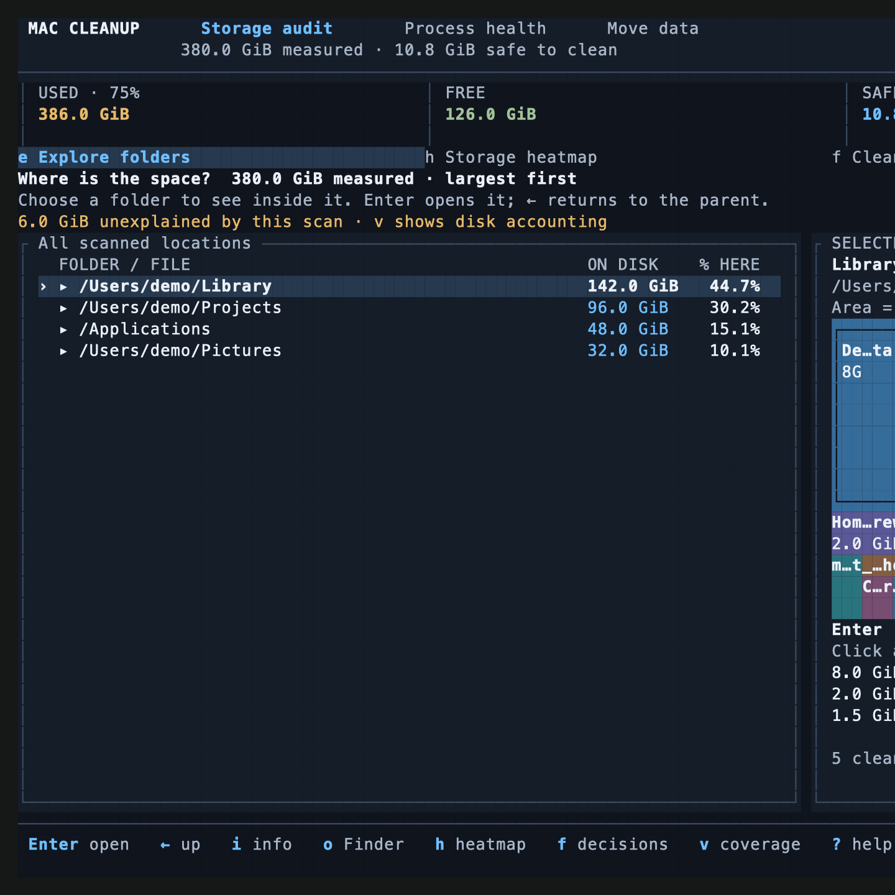

# Mac Cleanup

[](https://github.com/maximpri/mac-cleanup/actions/workflows/ci.yml)
[](LICENSE)


Mac Cleanup finds disk space that can be reclaimed safely: files already in
Trash or a volume recycle bin, temporary data, development artifacts, package
caches, and other regenerable downloads. It also identifies large app-managed
storage that may be worth reviewing without treating it as disposable. Its full-screen
[Ratatui](https://ratatui.rs/) interface starts read-only and makes no changes
unless cleanup is explicitly requested in the UI or with `--clean`, and the
user confirms a selection. It also reviews processes that macOS explicitly
reports as dead/zombie, stopped, or stuck in an uninterruptible wait.

Every storage scan also accounts for the selected filesystem and walks its
real directories. The report shows capacity, used/free space, top-level
directories, and the largest nested files/directories so a nearly full SSD is
explained even when its space is not a safe cache to delete. These inventory
paths are review-only; the cleanup allowlist remains separate.

The default mode is read-only. Do not run the app with `sudo`.

> [!IMPORTANT]
> The `mac-cleanup` package currently published on crates.io is an unrelated
> project. Install this project only from this repository or its GitHub
> Releases. Registry publication is disabled in this repository to prevent
> accidental name confusion.

## Install and run

Requirements: macOS, Rust 1.88 or newer, and a normal user account.

Full Disk Access is optional. If macOS reports `SCAN ERROR` for a protected
user cache you intentionally want to inspect, grant it to the terminal in
System Settings → Privacy & Security → Full Disk Access, then rescan. The app
does not treat an unreadable directory as empty or eligible for cleanup.

```bash
git clone https://github.com/maximpri/mac-cleanup.git
cd mac-cleanup
cargo build --release
./target/release/mac-cleanup
```

To place a source-built binary in Cargo's binary directory instead, run
`cargo install --path . --locked`. Prebuilt binaries, when available, are
published only on this repository's Releases page.

The workspace has one persistent menu on the left and the selected section on
the right. Click Storage audit, Process health, or Move data, or use
keys `1`–`3`. Press `Tab` or `Shift+Tab` to switch between the top menu and content
(`F8` is an alternative). A FOCUSED label identifies the pane receiving keys.
Use Up/Down to choose a menu item and Enter or Right to open it. The app starts
the storage audit automatically; opening a section transfers focus to its content. A single-line top menu stays visible at
every supported size, with a status bar beneath it and no duplicate task cards.
Menu keys never trigger content actions. A mouse click focuses its pane, and
scrolling operates on the pane under the pointer. Read-only sessions disable
Move data in the menu. Storage returns to an existing audit when available. `F9` opens additional
commands, including File → Choose scan location for another volume.


Storage opens with **Explore folders**, a size-sorted browser of everything the
scan measured. Press `Enter` or `→` to open a directory, `←` or `Backspace` to
return, and `i` for item information (also available in narrow terminals).
`o` reveals the selected file or folder in Finder. Click a row to select it;
click the selected row again to open it. The app retains all measured direct
children, so drilling down needs no terminal commands or repeated scans.
Each level shows allocated size, percentage of its measured children, and size
bars on wide screens. Folder totals include their children; each list contains
one level rather than overlapping ancestors and descendants.
On wider terminals, the selected folder's **nested storage map** fills the right
panel. Rectangle area represents allocated space; nested rectangles show its
subfolders and files. Labels give names and sizes, with the largest children
listed below. Click a rectangle to open that exact folder or inspect a file.
`h` expands the selected item's map; `e` returns to the browser. Both share the
same selection and navigation history. In narrow terminals, use `h` for the map
and `i` for details.

Colors distinguish folder branches, not cleanup eligibility. The map shows up
to three child levels and ten named items per level; smaller items are grouped,
while amounts missing from measured children appear as **Other / unmeasured**.
Items too small for a terminal cell remain accessible in the folder browser.
The map footer links to cleanup findings with `f` when available. The status bar
shows the current scan state and the top menu keeps section navigation visible;
menu items and storage tabs use single-line highlights.

Use the four storage tabs, their letter shortcuts, or `[` / `]`:

- **e Explore folders** — follow the space usage down to individual files.
- **h Storage heatmap** — expand the selected folder's nested map. Use `↑` / `↓`
  to select siblings, click a rectangle to open it, or `Enter` to open the
  selected folder. `e` returns to the folder list.
- **f Cleanup decisions** — inspect findings, removal impact, recovery, and the
  recommended next step. From Explore or Heatmap, this selects an exact matching finding
  or a finding inside the selected folder when available. `e` opens the selected
  finding's contents when they were measured. Space selects a safe item;
  Enter reviews the selection. `c` reviews all safe items; `d` reviews one item.
- **v Scan coverage** — explains measured space, unexplained volume usage,
  other APFS volumes / metadata, local snapshot dates, and unreadable paths.
  `p` opens Full Disk Access settings; `r` scans again. Scroll for all details.

The disk summary includes the percentage used, remaining space, and the safe
cleanup estimate. Incomplete scans are labeled explicitly. APFS container
usage can exceed the files measured on one volume; unexplained space is never
presented as reclaimable. Exploration itself never selects or deletes data.
Deletion still requires the existing exact-path confirmation; app-managed
review data still requires typing `DELETE`. The initial screen starts the
read-only audit automatically, and `Esc` opens the location picker if you want
to change the scan scope.

To start directly in cleanup mode, use:

```bash
./target/release/mac-cleanup --clean
```

The app scans each allowlisted location, shows its size and safety status, and
lets you inspect every exact path before selecting anything. Cleanup uses a
separate permanent-deletion confirmation dialog listing the exact targets and rechecks each selected item
immediately before touching it. Press `o` on a finding to reveal that exact
directory in Finder before deciding what to do.

The Storage audit can open its location picker. Choose the home directory, the
startup volume, or any mounted volume listed under `/Volumes`. Home scans look
for user Trash and regenerable caches. Volume scans look for real volume-level
waste such as `.Trashes`, `#recycle`, `@Recycle`, `$RECYCLE.BIN`, and
`.TemporaryItems`. The picker labels each location as `LOCAL`, `USB`, or
`NETWORK`, orders local storage first, and selects the local startup volume by
default. Personal files are never inferred to be waste.

## TUI controls

The interface uses high-contrast slate surfaces and a responsive command bar. Blue
marks navigation, green indicates availability, amber marks caution, and
coral identifies destructive decisions or failures. Labels convey the same
meaning without color; `NO_COLOR` and `--no-color` remain supported. The interface
requires at least 60 columns and 16 rows and blocks hidden actions in smaller
windows. Long details, help, and confirmations scroll while decision controls
remain visible.

| Key | Action |
| --- | --- |
| `1` / `2` / `3` | Open Storage / Process Health / Move Data. |
| `PgUp` / `PgDn` | Page through lists or scroll long dialog details. |
| `↑` / `↓` and `Enter` | Choose and open a task from the menu; move through lists elsewhere. |
| Navigate menu | Open Storage, Process Health, or Move data from any non-modal screen. |
| `?` | Open the in-app help overlay. |
| `F1` | Open Help. |
| `Tab` / `Shift+Tab` / `F8` | Switch focus between the top menu and content. |
| `F9` / `F10` | Open the commands menu / quit. `Alt+F`, `Alt+N`, `Alt+A`, and `Alt+H` open File, Navigate, Actions, and Help. |
| Mouse | Click the top menu or visible table rows; use the wheel to scroll lists and dialogs. |
| `↑` / `↓` or `j` / `k` | Move through the current list. |
| `e` / `h` / `f` / `v` | Explore folders / storage heatmap / cleanup decisions / scan coverage. `[` / `]` cycles these views. |
| `←` / `Backspace` | Return to the parent in Explore or Heatmap. |
| `Space` | In Cleanup decisions, select or deselect the highlighted eligible item; available from default mode. |
| `a` | Select or deselect all eligible items. |
| `c` | Select all safe `READY` items and open the cleanup confirmation. |
| `d` | Delete the highlighted safe item, opt in to one highlighted `OPTIONAL` item, or begin guarded deletion for a highlighted `REVIEW` item. |
| `m` | Open the largest-consumer relocation flow and move selected useful data to an external volume. |
| `o` | Reveal the highlighted exact path in Finder. |
| `i` | Explore or Heatmap: open scrollable item information. Cleanup decisions: toggle reinstallable items and rescan. |
| `r` | Rescan storage, or refresh the process list from process review. |
| `Enter` | Open the highlighted task, show details, or review selected cleanup items. |
| `y` | Confirm the permanent deletion in the confirmation dialog. |
| `t` / `k` | In process confirmation, send `SIGTERM` / explicitly send `SIGKILL`. |
| `n` or `Esc` | Cancel the confirmation dialog. |
| `q` | Quit, or stop after the current item while cleaning. |

While scanning, the interface reports the current location, inspected-item
count, allocated size found so far, and elapsed time. A full-volume inventory
runs after the allowlisted locations finish; on macOS this includes the
separate startup/data volume layout. The progress bar animates smoothly from
zero through the active category but does not cross the next category
boundary until that work finishes. Its counter reports completed categories, so
a new scan begins at `0/total`. `Esc` cancels the scan and returns to the
location picker; `q` quits.

After cleanup, the final summary closes automatically after five seconds.
Press `Enter`, `q`, or `Esc` to close it immediately.

The default TUI starts in analysis mode. `d` opens confirmation for the single
highlighted safe item. On an `OPTIONAL` finding, it explicitly opts in only that
reinstallable item and warns that a large download may be needed later; `i`
still opts in all reinstallable findings. On a `REVIEW` finding, `d` starts the
guarded typed-confirmation flow. `c` selects all currently safe items. Passing
`--analyze` explicitly locks the entire run to read-only analysis and hides
these actions. In writable mode, `m` opens the largest-consumer list; choose a
directory, enter an existing destination under `/Volumes`, review the verified
plan, and confirm with `y`.

## Process review

Choose Process Health from the top menu, or from Navigate → Process
Health on another screen. The scan begins only after that explicit selection.
The screen lists current-account processes so a visibly hung app can still be
found and terminated even when macOS reports an ordinary run state. Explicit
abnormal states are sorted to the top and highlighted:

- `STUCK WAIT` is blocked in an uninterruptible kernel wait (`U` or `D`);
- `STOPPED` is suspended by job control, a debugger, or another signal (`T`);
- `DEAD/ZOMBIE` has exited but has not yet been reaped by its parent (`Z`).

`RUNNING` means no explicit abnormal state was reported; it does not prove the
application UI is responsive. Review its command, CPU use, and elapsed time
before acting. The scanner does not infer a hang solely from high CPU use. A
zombie is already dead, so sending it another signal cannot remove it; its
parent must reap it, or the parent/session must be restarted.

For a signalable entry, press `d` and choose `t` to request a graceful exit
with `SIGTERM`, or `k` to explicitly force termination with `SIGKILL`. No
escalation is automatic. Immediately before signalling, Mac Cleanup checks the
PID, current-account ownership, parent PID, and start time again to guard
against PID reuse. A previously flagged process that recovered is also
protected. Mac Cleanup never signals itself or an ancestor process.
`--analyze` disables process actions, and `--clean --yes` never kills processes
unattended.

## Scan another volume

Use the location picker in the TUI, or pass the mounted volume path explicitly
for line-oriented output and automation. NAS/server-managed recycle directories
are separate from the Trash shown by Finder, so an empty Finder Trash does not
mean a share's `#recycle` or `@Recycle` directory is empty:

```bash
./target/release/mac-cleanup --volume "/Volumes/Work Drive"
./target/release/mac-cleanup --analyze --no-tui --verbose --volume "/Volumes/Work Drive"
```

The path must be an accessible real directory, not a symlink. For example, if a
NAS share uses `/Volumes/DATA/#recycle`, selecting `/Volumes/DATA` reports the
size of that recycle bin. A mounted macOS system volume also checks the matching
current-account home under `Users`, when present. Select a user-home directory
directly with `--volume` when that is the intended layout. Plain output also
reports the detected storage type.

## `/private/tmp` retention

When the startup volume (`/`) is scanned, Mac Cleanup applies a separate
retention policy to direct children of `/private/tmp`. The default threshold is
seven days, based on each entry's modification time; change it with
`--tmp-retention-days <DAYS>`. An entry is eligible only when it is owned by the
current account, its complete directory tree is also owned by that account, and
`lsof` finds no process with the entry open. Top-level symlinks, recent entries,
other users' entries, and anything that cannot be checked are left alone.

Eligible files and directories appear with their exact `/private/tmp/...` paths
in the report and as ordinary `READY` cleanup findings. Analysis is read-only.
`--clean --yes` removes only those individually allowlisted exact paths; it
never removes `/private/tmp` itself. If the open-file check is unavailable, the
policy fails closed and reports zero eligible entries. Rescanning after a
cleanup refreshes the policy.

The same retention threshold drives two more age-based cleanup sources:

- **Incomplete downloads.** `*.crdownload`, `*.part`, and `*.download` entries
  in the account's `Downloads` folder that are owned by the current account,
  untouched past the retention age, and not open by any process become exact
  `READY` findings labeled "Incomplete download". If the open-file check for
  the Downloads folder cannot run, none are offered.
- **Aged directories.** `~/Library/Logs` (7 days), `~/Library/Saved Application
  State` (30 days), and `~/Library/DiagnosticReports` (30 days) keep their
  recent contents and release only direct entries untouched past their
  retention window. Symlinks and newer entries always stay, and the directory
  itself is retained.

## Cache statuses

| Status | Meaning |
| --- | --- |
| `READY` | The allowlisted target exists and all current safeguards passed. Ordinary cache directories are emptied; aged directories release only stale entries; retention candidates are removed as exact paths. |
| `OPTIONAL` | Regenerable, but needs explicit opt-in. Press `d` for only the highlighted item or `i` to opt in all reinstallables. |
| `REVIEW` | Large app-managed or personal data. Excluded from ordinary and unattended cleanup; clean mode offers guarded single-item deletion. |
| `PROTECTED` | Matches the user whitelist (`~/.config/mac-cleanup/whitelist`); every cleanup path refuses it. |
| `IN USE` | A related application or package manager appears active. |
| `SCAN ERROR` | The directory or a required safety check could not be read completely, so cleanup is disabled. Protected user data may require Full Disk Access. |
| `SYMLINK` | The path or one of its parent components redirects elsewhere. |
| `INVALID` | The allowlisted path is an unexpected file type. |
| `MISSING` | There is nothing to clean at that path (plain `--verbose` output only). |

Close Telegram, Chrome and other Google apps, TradingView, ZCode, package
managers, and development tools before cleanup. A candidate whose related
process is running is automatically unavailable.

## User whitelist

Create `~/.config/mac-cleanup/whitelist` to protect locations from every
cleanup path, including unattended cleanup and confirmed review deletion. Each
non-empty, non-comment line is one path pattern: relative patterns resolve
against the account home directory, a leading `~/` also resolves there, `*`
matches any characters within one path component (`?` matches one character),
matching is case-insensitive, and a matching directory also protects everything
inside it. Both spellings of a symlinked location are honored (for example
`/tmp` and `/private/tmp`).

```text
# never touch these
Library/Caches/Adobe
~/Library/Developer
/private/tmp/my-important-dir
```

## Cleanup levels

Routine cleanup includes:

- user Trash and volume-level Trash, recycle-bin, and temporary folders
- pip, node-gyp, Homebrew, Python, npm package, and OpenCode caches
- Go, uv, Yarn, Xcode derived-data, and Simulator caches
- Safari, Firefox, Google, and Adobe caches; browser profiles and browsing data remain
- TradingView and ZCode updater downloads
- Telegram cached media and thumbnails; messages are not removed
- old log entries, old window-restoration data, and old crash reports (see
  the aged directories above), plus abandoned partial downloads

The `/private/tmp` retention policy is reported separately because it is based
on age and open-file checks rather than a fixed cache location. Its eligible
entries are included in the safe-cleanup total.

The following regenerable downloads are visible but unavailable by default:

- Playwright and Playwright Go browser binaries
- temporary `npx` package installations
- Codex runtimes
- Gradle, SwiftPM, and Hugging Face caches
- CocoaPods downloads and Cypress application binaries

Press `d` in the TUI to opt in and confirm only the highlighted item, press `i`
to make all of them eligible, or start with `--include-reinstallable`. Using
their associated tools later may trigger a large download.

Large app-managed areas are also shown as `REVIEW` findings when present:

- Chrome DevTools MCP persistent browser profile (sessions, cookies, and site data)
- Xcode archives, iOS device-support files, and Simulator devices
- Cursor user and workspace data
- OrbStack containers, images, machines, and volumes
- Telegram local account and media data

These locations can contain valuable state. They are never included in normal
selection, “select all,” or unattended cleanup and should preferably be reduced
using the controls in Xcode, Cursor, OrbStack, or Telegram. Clean mode also
offers advanced deletion for one highlighted `REVIEW` item at a time: highlight
it and press `d`, inspect the exact path and impact, then type `DELETE`. This
permanently clears everything inside that app-managed directory and can remove
settings, history, containers, simulator apps, or local account data. The
related app must be closed, and the same path, symlink, type, and allowlist
checks are repeated immediately before deletion.

### Native-command cleanup

When a vendor provides a non-interactive command that can be confined to the
current account's matching cache, Mac Cleanup runs it before touching files
directly:

| Finding | Native command used first |
| --- | --- |
| pip | `python3 -m pip cache purge` |
| npm packages / npx packages | `npm cache clean --force` / `npm cache npx rm` |
| Go / uv / Yarn | `go clean -cache -testcache -fuzzcache` / `uv cache clean` / `yarn cache clean` |
| SwiftPM | `swift package purge-cache` |
| Playwright | `playwright uninstall --all` |
| CocoaPods / Cypress | `pod cache clean --all` / `cypress cache clear` |
| Hugging Face | `hf cache prune --yes` |
| Simulator devices | `xcrun simctl delete all` |
| OrbStack data | `orbctl reset --yes` |

Cache-directory flags or documented environment variables pin commands to the
allowlisted path where the tool supports them. Commands have a 30-minute
timeout and run in the background so the TUI remains responsive. If a command
is unavailable, fails, or leaves files behind, the existing symlink-safe
exact-path cleanup removes only those remaining contents. The details screen
shows the planned strategy, and the TUI and line-oriented output report what
actually ran after cleanup.

Candidates without a safe, exact-scope command use only the guarded path
cleanup. For example, `brew cleanup --prune=all` can affect installed formulae
and locations beyond the displayed Homebrew cache, `xcodebuild clean` requires
a specific project, and Gradle performs retention cleanup during builds rather
than offering a global cache-clear command. Mac Cleanup does not broaden the
deletion scope merely to use a command.

## Automation and plain output

When input or output is redirected, the app automatically emits line-oriented
plain text. `--no-tui` forces that behavior. The default plain-output scope is
the local startup volume; pass `--volume` to inspect a specific home or mounted
volume. Findings are ordered largest-first, and analysis remains read-only:

```bash
./target/release/mac-cleanup --analyze --no-tui --verbose
```

For scripts and inventory tools, `--json` emits a versioned report and implies
non-interactive output. Sizes are allocated filesystem kilobytes, paths are
exact, and cleanup outcomes are included when cleanup was requested:

```bash
./target/release/mac-cleanup --json | jq '.storage_inventory, .summary, (.items[] | select(.size_kb > 0))'
./target/release/mac-cleanup --clean --yes --json > cleanup-report.json
```

The top-level `schema_version` is currently `5`. Runtime scan and validation
errors remain machine-readable after argument parsing. `--json` cannot be
combined with `--verbose`. Reports include the scan location and storage type,
a `storage_inventory` with filesystem capacity/usage, APFS container free space
when `diskutil` reports it, the dates of local Time Machine snapshots
(`local_snapshots`, report-only), scan coverage, top-level
usage, and largest review-only paths; aggregate cleanable/opt-in/review/protected
totals; every allowlisted item; a `temp_retention` report with the threshold, exact
eligible paths, skipped-entry counts, and safety-check status; a
`process_review` inventory; and—when applicable—the result of each cleanup
attempt. A positive
`storage_inventory.unaccounted_kb` means filesystem usage was not visible in
the directory walk; on APFS this can include snapshots or protected/system-
managed data, and a partial scan can also contribute.

For unattended cleanup, `--yes` clears every currently eligible item without
opening the TUI. With `--relocate`, it confirms the explicitly requested move
instead. Path, symlink, type, allowlist, and process checks still apply:

```bash
./target/release/mac-cleanup --clean --yes
./target/release/mac-cleanup --clean --include-reinstallable --yes
```

Because `--yes` permanently deletes contents without individual selection,
review a fresh analysis immediately beforehand.

## Options

```text
--analyze                 Read-only report (default)
--clean                   Select and clear eligible removable-data contents
--relocate <PATH>         Preview or relocate one large user-owned directory
--relocate-to <PATH>      Existing destination directory on an external volume
--include-reinstallable   Include items that may need a large download
--tmp-retention-days <DAYS>
                          Treat user-owned /private/tmp entries as stale after this many days (default: 7)
--volume <PATH>           Scan known waste and inventory this volume or home directory
--yes                     Confirm cleanup or relocation without the TUI
--verbose                 Show missing items and exact paths in plain output
--json                    Emit a versioned machine-readable report
--no-color                Disable colored output
--no-tui                  Force line-oriented output
-h, --help                Show command help
-V, --version             Show the application version
```

## Relocating large directories

For a large directory that is useful but does not need startup-disk
performance, use the explicit relocation command. It requires an existing
directory on a mounted volume under `/Volumes`; the destination must be on a
different filesystem and network volumes are rejected. The source must be a
real directory inside the current account's home or a child of
`/private/tmp`, with no symlinks, special files, other-user-owned entries, open
file handles, or running owning application.

The command first copies the directory to `<destination>/<source-name>`,
compares the copied tree with the source, then renames the source to a private
temporary backup and creates an absolute symlink at the original path. The
backup is removed only after the link is verified. A failed copy or validation
leaves the original directory untouched. Without `--yes`, the command only
prints the plan:

```bash
./target/release/mac-cleanup \
  --relocate "$HOME/Library/Developer/Xcode/iOS DeviceSupport" \
  --relocate-to "/Volumes/EXT_DISK/MacCleanup"
```

After reviewing the source, destination, size, and file count, perform it with:

```bash
./target/release/mac-cleanup \
  --relocate "$HOME/Library/Developer/Xcode/iOS DeviceSupport" \
  --relocate-to "/Volumes/EXT_DISK/MacCleanup" \
  --yes
```

The original path remains usable through the symlink, while new data is stored
on the external volume. Keep that volume mounted before starting the owning
application. Relocation is never part of `--clean --yes` and is never inferred
from the largest-consumer inventory.

## Safety model

- Analysis is the default and cannot modify files.
- `REVIEW` findings cannot enter ordinary selection or unattended cleanup.
  Advanced TUI deletion is single-item only and requires a typed confirmation.
- Cleanup refuses to run as root or through `sudo`.
- Only exact known waste paths constructed for the selected location can be
  cleared.
- Volume roots are canonicalized, and symlink roots are rejected.
- The app rejects a candidate if it or any path component is a symlink.
- Related running applications and package managers block cleanup. The process
  check is repeated immediately before deletion.
- Ordinary cache directories are retained while only their contents are removed;
  `/private/tmp` retention candidates are exact paths and are removed only after
  ownership and open-file checks are repeated immediately before deletion.
- Every cleanup target's filesystem identity (device and inode numbers of the
  path and its parent) is captured during the scan and re-verified at the
  deletion step itself. A path that was deleted and recreated, renamed, or
  swapped after the scan is refused, and a target whose identity could not be
  captured is never cleaned.
- Whitelisted paths are refused by every cleanup path; see the user whitelist
  section above.
- Symlinks inside an eligible cache are unlinked without following them.
- Every cleanup attempt (cleared, skipped, or failed) is appended to
  `~/Library/Logs/mac-cleanup/deletions.log` with the timestamp, reclaimed
  size, and exact path, so permanent deletions remain auditable.
- Large runtimes and browser binaries require explicit opt-in.
- The full-volume inventory is read-only and review-only; it never turns
  personal files, application data, or large files into cleanup candidates.
- Ordinary cleanup excludes documents, projects, messages, browser profiles,
  Application Support, containers, and macOS system files. A few explicitly
  listed `REVIEW` locations can be cleared only through the separate typed
  confirmation described above.
- `/private/tmp` retention is limited to old, current-account-owned, unopened
  direct children; an inability to prove eligibility leaves the entry untouched.
- Relocation is a separate explicit operation: it copies and verifies one
  directory before replacing its original path with a symlink; it is never
  included in automatic cleanup.

Deletion is permanent rather than moving data to Trash because files in Trash
continue occupying disk space. The final summary distinguishes measured cache
contents removed from the filesystem free-space change; APFS accounting and
concurrent app activity can make those values differ slightly.

## Interface preview



The preview uses synthetic data. [Storage audit preview](docs/images/storage.png).

## Architecture

See the [performance and cleanup journey review](docs/PRODUCT_REVIEW.md) for
current product findings and the proposed workflow, and
[architecture](docs/ARCHITECTURE.md) for module boundaries and safety invariants.

## Contributing and security

Contributions are welcome. Read [CONTRIBUTING.md](CONTRIBUTING.md) before
changing cleanup paths or deletion behavior; those changes have additional
safety and test requirements. User-visible changes are tracked in
[CHANGELOG.md](CHANGELOG.md).

Do not report path escapes, unintended deletion, confirmation bypasses, or
other vulnerabilities in a public issue. Follow [SECURITY.md](SECURITY.md) to
submit them privately. Community participation is governed by
[CODE_OF_CONDUCT.md](CODE_OF_CONDUCT.md).

## License

Mac Cleanup is available under the [MIT License](LICENSE).
