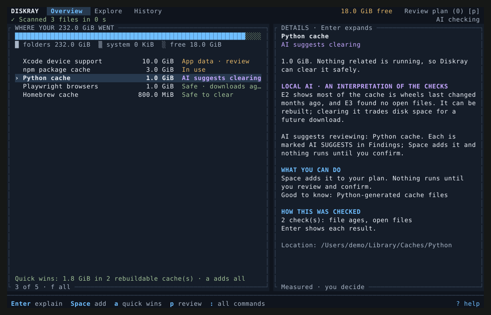
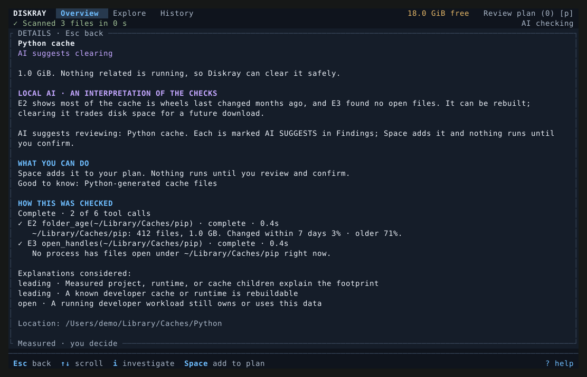

# Diskray

*An X-ray for your Mac's disk. Understand before you delete.*

[](https://github.com/maximpri/diskray/actions/workflows/ci.yml)
[](LICENSE)




"System Data is 180 GB" is not an answer. Diskray measures where the space
actually went, explains what each large item is and whether it is safe to
remove, and only then lets you act, one reviewed action at a time.

- **Evidence, not guesses.** Every finding shows what was measured: size, how
  recently files changed, which apps hold them open, which app owns them, and
  how much they grew since last week.
- **Private on-device AI with read-only tools.** On Apple silicon with Apple
  Intelligence, the local model investigates by calling Diskray's own
  measuring tools and must cite what it found. It never sees a cloud service
  and can never delete, move, or add anything to your plan.
- **The space other tools can't see.** Local snapshots, other APFS volumes, and
  space the folder walk cannot read are measured and shown, and every cleanup
  is verified afterwards against the free space macOS reports.

## Install

```bash
brew install maximpri/diskray/diskray
```

The formula builds from source. Or build it yourself (Rust 1.88+):

```bash
git clone https://github.com/maximpri/diskray.git && cd diskray
sh scripts/build-release.sh          # adds the AI helper when this Mac supports it
./target/release/diskray
```

Local AI needs Apple silicon, macOS 26 or later, and Apple Intelligence turned
on with its model downloaded.

> **Current AI requirement: English (United States).** For now, set both your
> Mac language and Siri language to **English (United States)** to use Diskray's
> embedded Apple Foundation Model. Allow Apple's model setup to finish.

See [local AI setup and verification](docs/AI.md) for availability diagnostics
and the live inference check.

Everything else works on any recent Mac. Full Disk Access is optional;
unreadable folders are reported as unreadable, never as empty.

## Thirty-second tour

```bash
diskray why                          # one screen: what fills the disk and why
diskray                              # interactive: explore, investigate, review, verify
diskray ask "why is my disk almost full?"
diskray artifacts                    # node_modules, target, .venv in projects untouched for 60+ days
claude mcp add --scope user diskray -- diskray mcp   # give coding agents read-only disk tools
```

The interactive app uses **two panels**: storage items and their status on the
left, an explanation and actions on the right. `Tab` switches focus, `e` browses
a folder (`Enter` / `Right` also drills down), `h` opens saved scans, and `Space`
adds a supported cleanup action to your plan. `t` queues a selected personal item
for a separate, reviewed Move to Trash; this frees no space until Trash is emptied. `p`
reviews that plan before anything runs; `:` lists every command.
The **Ask AI** input stays open below both panels. Press `/` or click it to
type; `Esc` returns to browsing and keeps your draft.



## The safety promise

1. Measuring never changes anything. `--analyze` locks a whole session read-only.
2. Nothing runs until you review exact paths and type `CLEAN`, `APPLY`, or `DELETE`.
3. Only known, rebuildable locations are ever cleared automatically. Personal
   and app data is review-only, and your whitelist is always honored, including
   files inside a cache.
4. AI and coding agents can suggest or propose. They cannot act.
5. Every deletion is logged in `~/Library/Logs/diskray/deletions.log`.

Details: [docs/SAFETY.md](docs/SAFETY.md).

## How it compares

**[Mole](https://github.com/tw93/Mole)** is an excellent, fast GPL-3.0 cleaner
with far broader cleanup coverage and an app uninstaller. If you want to clear
many known caches quickly, use it. Diskray covers fewer locations on purpose and
focuses on explaining: hidden APFS space, per-item evidence, growth over time,
on-device AI investigations, and before/after verification.

**Coding agents** can run `du` and `rm` for you, but they improvise shell
commands with full delete rights and no memory of last week. Through
`diskray mcp`, an agent gets thirteen measured, read-only tools instead, and it
can only save a proposal that you review with `diskray review`.

## Documentation

| | |
| --- | --- |
| [Usage](docs/USAGE.md) | Commands, the interactive workspace, keys, JSON output, options |
| [Safety](docs/SAFETY.md) | Safeguards, cleanup levels, statuses, whitelist, relocation |
| [Local AI](docs/AI.md) | How on-device investigations work and are validated |
| [MCP](docs/MCP.md) | Connecting Claude Code, Cursor, Codex, and other agents |
| [Rule packs](docs/RULES.md) | Cleanup rules as TOML, and writing your own |
| [Navigation](docs/TUI_NAVIGATION.md) | Screen-by-screen interface behavior |
| [Architecture](docs/ARCHITECTURE.md) | Module boundaries and safety invariants |

## Contributing and security

Contributions are welcome, and new rule packs are a great first contribution.
Read [CONTRIBUTING.md](CONTRIBUTING.md) first: changes to cleanup paths or
deletion behavior have extra safety and test requirements. Report path escapes,
unintended deletion, or confirmation bypasses privately via
[SECURITY.md](SECURITY.md), not in a public issue. Participation is governed by
the [Code of Conduct](CODE_OF_CONDUCT.md). Changes are listed in
[CHANGELOG.md](CHANGELOG.md).

## License

Diskray is free software: you can redistribute it and/or modify it under the
terms of the [GNU General Public License](LICENSE) as published by the Free
Software Foundation, either version 3 of the License, or (at your option) any
later version. It is distributed in the hope that it will be useful, but
WITHOUT ANY WARRANTY; see the license for details.
