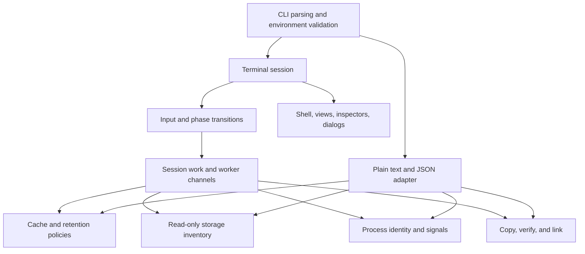

# Mac Cleanup: purpose, product goals, and architecture

The current product direction and end-to-end findings are in the
[performance and cleanup journey review](PRODUCT_REVIEW.md). That review
supersedes older UI proposals below; proposed capabilities are not yet implemented.

## Purpose

Mac Cleanup helps a Mac owner understand storage pressure and make deliberate
maintenance decisions. It accounts for filesystem usage, finds known disposable
data, reviews process health, and can move useful directories to external storage.
The useful outcome is an informed decision about an exact target; a large number
of deleted bytes is not itself a measure of success.

The application remains a local Rust terminal utility. That fits its existing
macOS filesystem integration, keyboard-driven use, and plain-text/JSON automation
interfaces. There is no server, browser runtime, telemetry, or background agent.

## Product goals

1. Diagnose performance pressure and explain storage usage, including data that should be kept.
2. Distinguish reclaimable caches, optional downloads, app-managed data, and
   locations that cannot currently be acted on.
3. Connect evidence to an understandable action, exact scope, and expected benefit.
4. Require an explicit decision for deletion, relocation, and process signals.
5. Stay usable on ordinary terminals and expose navigation without memorized keys.
6. Verify outcomes, keep results available, and support further investigation.
7. Preserve the existing CLI and versioned JSON contract for automation.

## Review of the starting architecture

The domain split was already useful: cache policy, inventory, retention,
relocation, and process management had separate modules and safety tests. These
modules encode valuable behavior and were retained.

The main problem was the 6,647-line `tui.rs`: session state, workers, input,
geometry, renderers, and tests lived together. That made changes hard to review
and let painted controls drift from their input handling. The standard storage
screen squeezed disk accounting, findings, details, and commands into the same
small vertical area. Cleanup confirmation summarized a count and total instead
of listing every exact target. Some modal phases also left the menu accessible.

## Redesign

The interface uses warm charcoal surfaces, ivory text, amber navigation, green
availability, blue-gray review states, and coral destructive decisions. Labels
and focus markers communicate state independently of color. Terminal font choice
remains under the user's control.

- **Storage audit:** location selection, visible scan stages, readable findings,
  and separate reclaimable/selected totals. Wide terminals have a persistent
  inspector; normal terminals use a lower details panel and an expandable dialog.
- **Process health:** current-account process inventory with explicit abnormal
  states and separate graceful/force signal choices.
- **Move data:** source review, destination input, validation, confirmation,
  verified copy, and result. This remains separate from ordinary cleanup.
- **Confirmations:** exact targets and consequences scroll independently of the
  always-visible decision controls. They own keyboard and mouse interaction.

A persistent sidebar is shown at every supported width, with shorter labels
in narrow terminals. Tab switches focus between the sidebar and content.
Number keys 1–3 and mouse navigation share the same destinations. At less
than 60 columns or 16 rows, the UI displays a resize message and blocks hidden
actions while still allowing cancellation and exit handling.

## Boundaries



| Module | Responsibility |
| --- | --- |
| `src/main.rs`, `src/cli.rs` | Parse options, validate environment, choose adapter |
| `src/cache.rs` | Exact cleanup targets, eligibility, native commands, revalidation |
| `src/storage.rs` | Filesystem accounting and read-only directory inventory |
| `src/retention.rs` | Age, ownership, and open-file policy for temporary entries |
| `src/processes.rs` | Process inventory, identity checks, explicit signals |
| `src/relocation.rs` | Validate destination, copy, verify, link, and rollback |
| `src/plain.rs` | Plain text and JSON schema version 5 |
| `src/tui/mod.rs` | Session types, terminal lifecycle, event loop |
| `src/tui/app.rs` | Scan and action orchestration, eligibility, worker results |
| `src/tui/input.rs` | Keyboard/mouse routing, navigation, modal ownership |
| `src/tui/scan.rs` | Bounded directory scan slices and worker construction |
| `src/tui/shell.rs`, `theme.rs` | Responsive frame, shared navigation geometry, semantic styles |
| `src/tui/*_view.rs`, `footer.rs` | Task-specific presentation |
| `src/tui/inspector.rs`, `dialogs.rs` | Exact-path context, consequences, scrollable decisions |
| `src/tui/helpers.rs` | Presentation helpers and visible table-row hit regions |
| `src/tui/tests.rs` | Behavioral regressions, layout checks, synthetic previews |

The terminal adapter's submodules are private. The rest of the program continues
to use only `tui::can_run()` and `tui::run()`. Domain modules do not depend on
terminal rendering. Renderers record only presentation metadata (visible row
hit regions and dialog scroll limits); they cannot initiate filesystem actions.

Directory scans process bounded slices between frames. Retention, full inventory,
cleanup, and relocation use existing background-worker channels. This is still a
single-session state machine, not a daemon. Individual filesystem operations and
process inspection can block; slow mounted volumes remain a constraint of the
current scanner rather than a guaranteed frame-time service.

Ratatui is pinned to 0.30.2 because the dialog uses its optional
`unstable-rendered-line-info` API to calculate actual wrapped text height. Keep
this call isolated in `dialogs.rs` and recheck the layout tests when upgrading.

## Invariants and verification

The redesign preserves the exact-target cleanup allowlist, opt-in downloads,
`REVIEW` isolation, typed confirmation, root/sudo rejection, symlink validation,
process checks, and pre-action revalidation. Disk inventory cannot create cleanup
eligibility. `--analyze` disables action selection. Normal cleanup never performs
relocation or process termination.

Tests exercise the existing safety model plus modal input isolation, visible
row selection, keyboard selection from default mode, read-only lockout, hidden
action prevention in small terminals, exact-path scrolling, and `NO_COLOR`.
Eight core screens render at 60×16, 80×24, 120×30, and 160×40. Previews use
invented paths and values, never a contributor's real cache inventory:

```bash
MAC_CLEANUP_RENDER_DIR=target/design-previews \
  cargo test --lib redesigned_screens_fit_supported_sizes_and_export_optional_previews --locked
```

The live terminal smoke test is repeatable with:

```bash
python3 scripts/smoke_tui.py target/release/mac-cleanup
```

It checks navigation, help, resize behavior, JSON analysis, confirmation/cancel,
and actual cleanup confined to files it creates in a temporary directory.

Release validation includes formatting, strict Clippy, all tests, Rustdoc,
release build, source packaging, and a real PTY smoke test. Local deployment
replaces the installed executable after preserving its previous version. Public
releases still follow `RELEASING.md` and require a reviewed, clean source tree.
