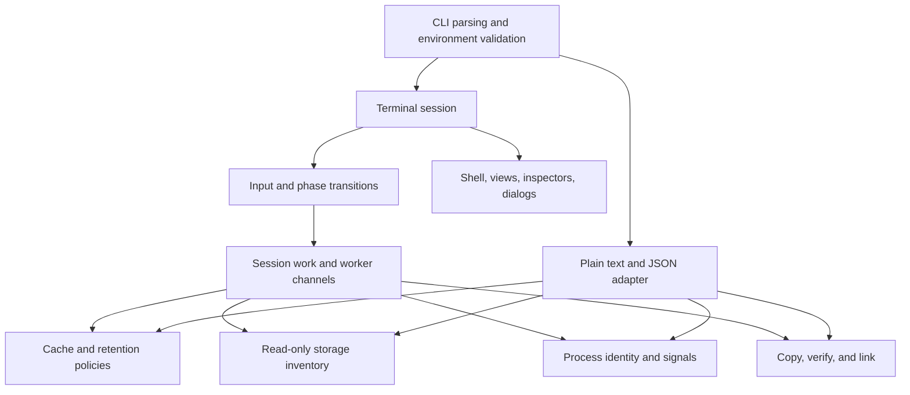

# Diskray: purpose, product goals, and architecture

The current product direction and end-to-end findings are in the
[performance and cleanup journey review](PRODUCT_REVIEW.md). That review
provides historical design context. The current implementation checkpoint is in
[IMPLEMENTATION_PLAN.md](IMPLEMENTATION_PLAN.md).

## Unified workspace implementation

- `src/care.rs` collects capacity, sampled CPU/RSS/pressure, cache findings, and
  storage inventory; classifies deterministic quick wins; records read-only
  high-memory system daemons such as `fseventsd`; and stores private bounded
  session records.
- `src/ai.rs` owns the helper transport: one `HelperProcess` with non-blocking
  line I/O (killed on drop), protocol-v3 correlation, a 32 KB line cap, and
  plain-language error codes. One-shot requests serve capabilities, triage
  (short model-facing IDs mapped back to findings, with a visibly labeled
  measured fallback), and History outcome summaries.
- `src/agent_tools.rs` defines the read-only tools the model may call, the
  per-family toolsets (at most six, to fit the 4,096-token context), the
  per-investigation handle table (`n#` folders, `p#` processes, `A#` eligible
  actions), 560-byte output caps, and deterministic supports/contradicts
  classification. Tools borrow app state or run existing collectors
  (`storage::folder_age`, `care::open_handle_owners`, `care::identify_owner`,
  `care::sample_process`, volume context, and the approval-gated trace).
- `src/agent.rs` drives one investigation. The interface tick owns the run:
  model tool calls arrive over the helper's pipe, are dispatched against a
  borrowed `ToolWorld`, slow collectors run on threads, and results return as
  numbered evidence. Budgets, deadlines, a context byte budget, approval waits,
  a measured fallback sequence, and a report-only finisher are enforced here.
  `validate_report` drops unissued references, downgrades unsupported verdicts,
  recomputes completeness, and keeps only still-eligible suggestions.
- `src/investigation.rs` owns the case record: hypotheses, typed evidence status,
  the tool-call timeline, the question for Ask cases, and validated suggestions.
  A failed or denied collector cannot strengthen a hypothesis. New fields default
  so older History records still load.
- `native/AIHelper.swift` calls Apple's on-device FoundationModels API. The
  `agent` operation creates a `LanguageModelSession` with one bridged `Tool` per
  Rust spec; each call is forwarded to Rust and answered on stdin through an
  actor that routes replies by call ID, so concurrent calls are safe. Handle
  arguments use regex-guided string schemas, and the final report uses a
  dynamic schema whose hypothesis IDs are constrained to the case. A hard cap
  stops a model that ignores its budget. The helper has no filesystem, shell,
  or remote capability of its own. `selftest` exercises the bridge without a
  model, and `measure` reports token budgets.
- `src/tui/care_view.rs` owns Overview/Explore/History, the command palette, model activity visuals,
  shared review plans, sequential execution, and before/after observations.
- Existing cache, process, whitelist, and relocation engines own all mutation
  safeguards. No model-generated path or signal is executed. Model suggestions
  are badges on actions Rust already allows; the user adds and confirms them.
- Administrator-assisted diagnostics are fixed read-only collectors. The TUI
  obtains explicit approval before invoking macOS authorization, records denial
  as unusable evidence, and never gives the model a shell or command arguments.
- `scripts/build-release.sh` builds both binaries. `check_ai_helper.py` checks
  framing and the tool bridge (concurrent calls, routing, caps, cancellation)
  without model assets, or runs a live synthetic tool-using investigation and
  prints token budgets with `--live`.
  `smoke_tui.py` checks terminal interactions and disposable-fixture cleanup.

## Purpose

Diskray helps a Mac owner understand storage pressure and make deliberate
maintenance decisions. It accounts for filesystem usage, finds known disposable
data, reviews process health, and can move useful directories to external storage.
The useful outcome is an informed decision about an exact target; a large number
of deleted bytes is not itself a measure of success.

The application remains a local Rust terminal utility. That fits its existing
macOS filesystem integration, keyboard-driven use, and plain-text/JSON automation
interfaces. There is no server, browser runtime, telemetry, or persistent
background service. “Agentic” means the on-device model selects from bounded
diagnostic capabilities while Rust owns execution, evidence, limits, and policy.

## Product goals

1. Diagnose performance pressure and explain storage usage, including data that should be kept.
2. Distinguish reclaimable caches, optional downloads, app-managed data, and
   locations that cannot currently be acted on.
3. Connect evidence to an understandable action, exact scope, and expected benefit.
4. Require an explicit decision for deletion, relocation, and process signals.
5. Stay usable on ordinary terminals and expose navigation without memorized keys.
6. Verify outcomes, keep results available, and support further investigation.
7. Preserve the existing CLI and versioned JSON contract for automation.

## Review of the starting architecture

The domain split was already useful: cache policy, inventory, retention,
relocation, and process management had separate modules and safety tests. These
modules encode valuable behavior and were retained.

The main problem was the 6,647-line `tui.rs`: session state, workers, input,
geometry, renderers, and tests lived together. That made changes hard to review
and let painted controls drift from their input handling. The standard storage
screen squeezed disk accounting, findings, details, and commands into the same
small vertical area. Cleanup confirmation summarized a count and total instead
of listing every exact target. Some modal phases also left the menu accessible.

## Redesign

The interface uses warm charcoal surfaces, ivory text, amber navigation, green
availability, blue-gray review states, and coral destructive decisions. Labels
and focus markers communicate state independently of color. Terminal font choice
remains under the user's control.

- **Storage audit:** location selection, visible scan stages, readable findings,
  and separate reclaimable/selected totals. Explore, Heatmap, Cleanup decisions,
  and Scan coverage share one inventory and drill-down state. Wide terminals have
  a nested treemap beside the folder browser; `h` expands it at every supported
  width, and `i` opens full decision details. `folder_map.rs` partitions terminal
  rectangles by allocated size and reads descendants from the existing inventory.
  Nested rectangles register their exact paths before parent hit regions, so
  clicking a child opens that child. Branch colors never imply cleanup eligibility.
  Small items are aggregated; unexplained parent bytes retain their own area.
  The top status bar shows scan status without duplicating the chart.
- **Process health:** current-account process inventory with explicit abnormal
  states and separate graceful/force signal choices.
- **Move data:** source review, destination input, validation, confirmation,
  verified copy, and result. This remains separate from ordinary cleanup.
- **Confirmations:** exact targets and consequences scroll independently of the
  always-visible decision controls. They own keyboard and mouse interaction.

A persistent top menu is shown at every supported width, with shorter labels
in narrow terminals. Tab switches focus between the top menu and content;
navigation has no numbered menu labels. At less than 60 columns or 16 rows, the
UI displays a resize message and blocks hidden actions while still allowing
cancellation and exit handling.

## Boundaries



| Module | Responsibility |
| --- | --- |
| `src/main.rs`, `src/cli.rs` | Parse options, validate environment, choose adapter |
| `src/cache.rs` | Exact cleanup targets, eligibility, native commands, revalidation |
| `src/storage.rs` | Filesystem accounting and read-only directory inventory |
| `src/retention.rs` | Age, ownership, and open-file policy for temporary entries |
| `src/processes.rs` | Process inventory, identity checks, explicit signals |
| `src/relocation.rs` | Validate destination, copy, verify, link, and rollback |
| `src/plain.rs` | Plain text and JSON schema version 5 |
| `src/rules.rs`, `rules/` | Cleanup rule packs as TOML: loading, validation, pinned native commands |
| `src/headless.rs` | The read-only assessment without the interface, shared by `why`, `ask`, and MCP |
| `src/why.rs` | The "why is the disk full" overview shared by `diskray why` and the Overview |
| `src/commands.rs` | `why`, `ask`, `artifacts`, and `rules` subcommands |
| `src/growth.rs` | Growth between comparable complete assessments |
| `src/artifacts.rs` | Report-only search for stale build output in untouched projects |
| `src/mcp.rs`, `src/pending.rs` | Read-only MCP server; agent proposals saved for `diskray review` |
| `src/paths.rs`, `src/migrate.rs` | User-data locations and the one-time move from `mac-cleanup` |
| `src/tui/mod.rs` | Session types, terminal lifecycle, event loop |
| `src/tui/app.rs` | Scan and action orchestration, eligibility, worker results |
| `src/tui/input.rs` | Keyboard/mouse routing, navigation, modal ownership |
| `src/tui/scan.rs` | Bounded directory scan slices and worker construction |
| `src/tui/shell.rs`, `theme.rs` | Responsive frame, shared navigation geometry, semantic styles |
| `src/tui/*_view.rs`, `footer.rs` | Task-specific presentation |
| `src/tui/inspector.rs`, `dialogs.rs` | Exact-path context, consequences, scrollable decisions |
| `src/tui/helpers.rs` | Presentation helpers and visible table-row hit regions |
| `src/tui/tests.rs` | Behavioral regressions, layout checks, synthetic previews |

The terminal adapter's submodules are private. The rest of the program continues
to use only `tui::can_run()` and `tui::run()`. Domain modules do not depend on
terminal rendering. Renderers record only presentation metadata (visible row
hit regions and dialog scroll limits); they cannot initiate filesystem actions.

Directory scans process bounded slices between frames. Retention, full inventory,
cleanup, and relocation use existing background-worker channels. This is still a
single-session state machine, not a daemon. Individual filesystem operations and
process inspection can block; slow mounted volumes remain a constraint of the
current scanner rather than a guaranteed frame-time service.

Ratatui is pinned to 0.30.2 because the dialog uses its optional
`unstable-rendered-line-info` API to calculate actual wrapped text height. Keep
this call isolated in `dialogs.rs` and recheck the layout tests when upgrading.

## Invariants and verification

The redesign preserves the exact-target cleanup allowlist, opt-in downloads,
`REVIEW` isolation, typed confirmation, root/sudo rejection, symlink validation,
process checks, and pre-action revalidation. Disk inventory cannot create cleanup
eligibility. `--analyze` disables action selection. Normal cleanup never performs
relocation or process termination.

Tests exercise the existing safety model plus modal input isolation, visible
row selection, keyboard selection from default mode, read-only lockout, hidden
action prevention in small terminals, exact-path scrolling, and `NO_COLOR`.
Eight core screens render at 60×16, 80×24, 120×30, and 160×40. Previews use
invented paths and values, never a contributor's real cache inventory:

```bash
MAC_CLEANUP_RENDER_DIR=target/design-previews \
  cargo test --lib redesigned_screens_fit_supported_sizes_and_export_optional_previews --locked
```

The live terminal smoke test is repeatable with:

```bash
python3 scripts/smoke_tui.py target/release/diskray
```

It checks navigation, help, resize behavior, JSON analysis, confirmation/cancel,
and actual cleanup confined to files it creates in a temporary directory.

Release validation includes formatting, strict Clippy, all tests, Rustdoc,
release build, source packaging, and a real PTY smoke test. Local deployment
replaces the installed executable after preserving its previous version. Public
releases still follow `RELEASING.md` and require a reviewed, clean source tree.
